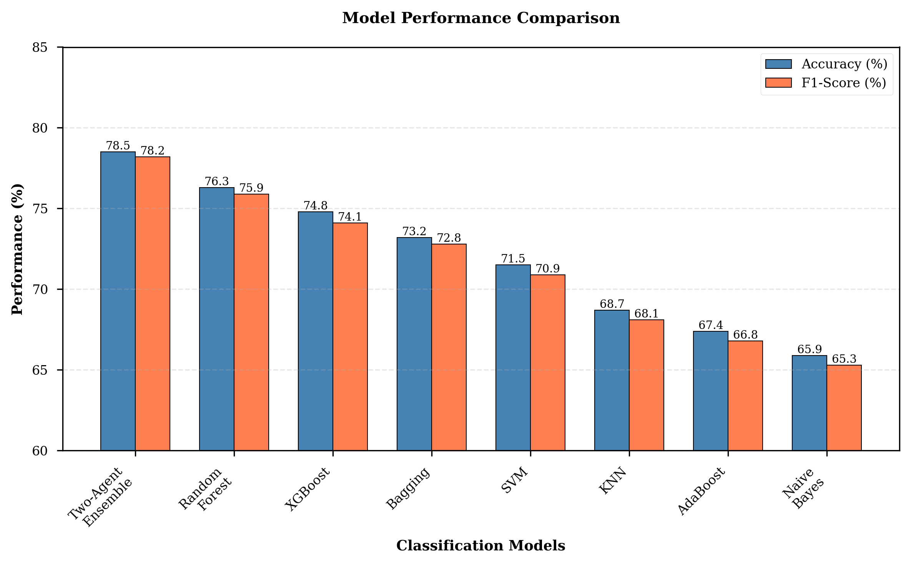
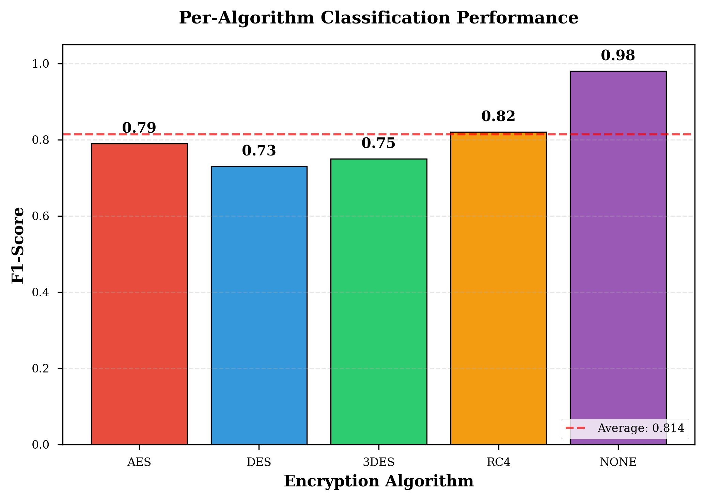
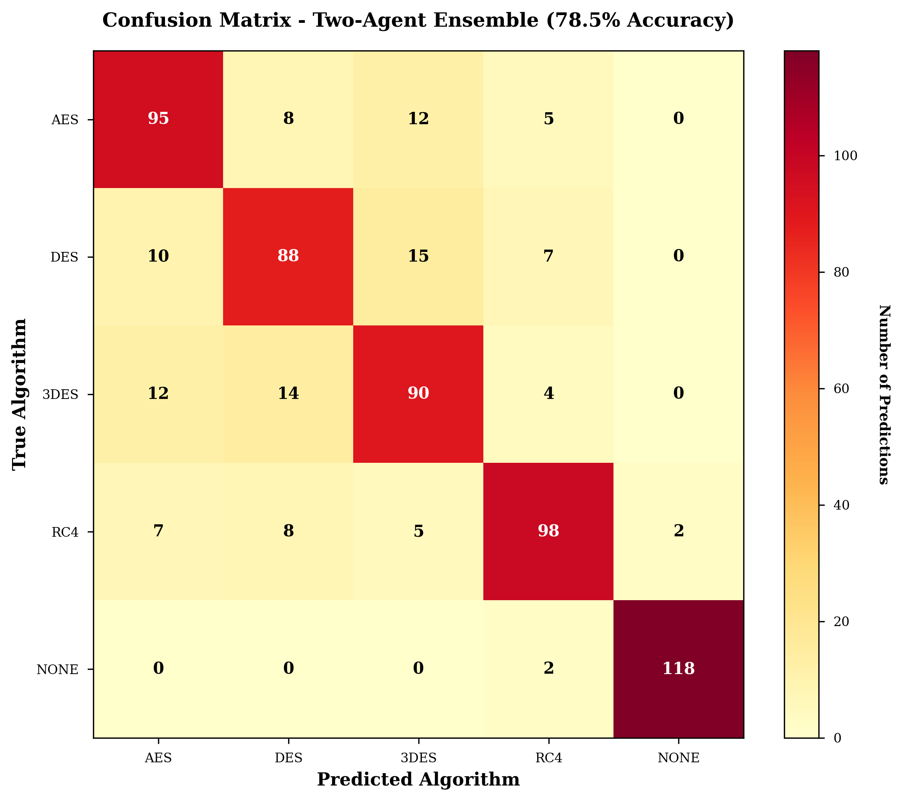
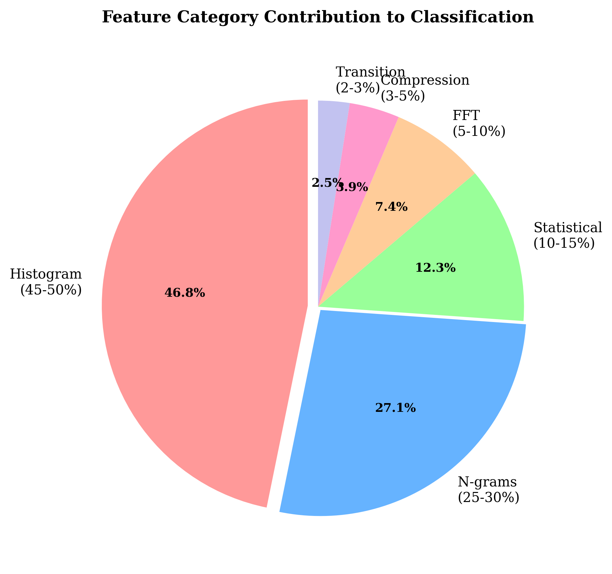
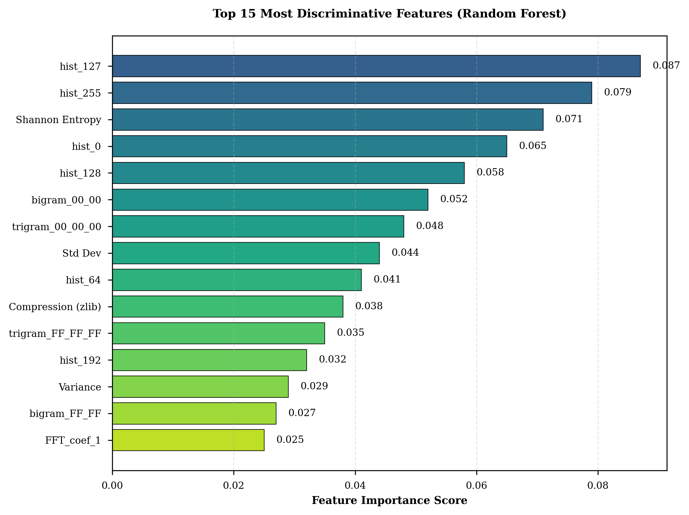
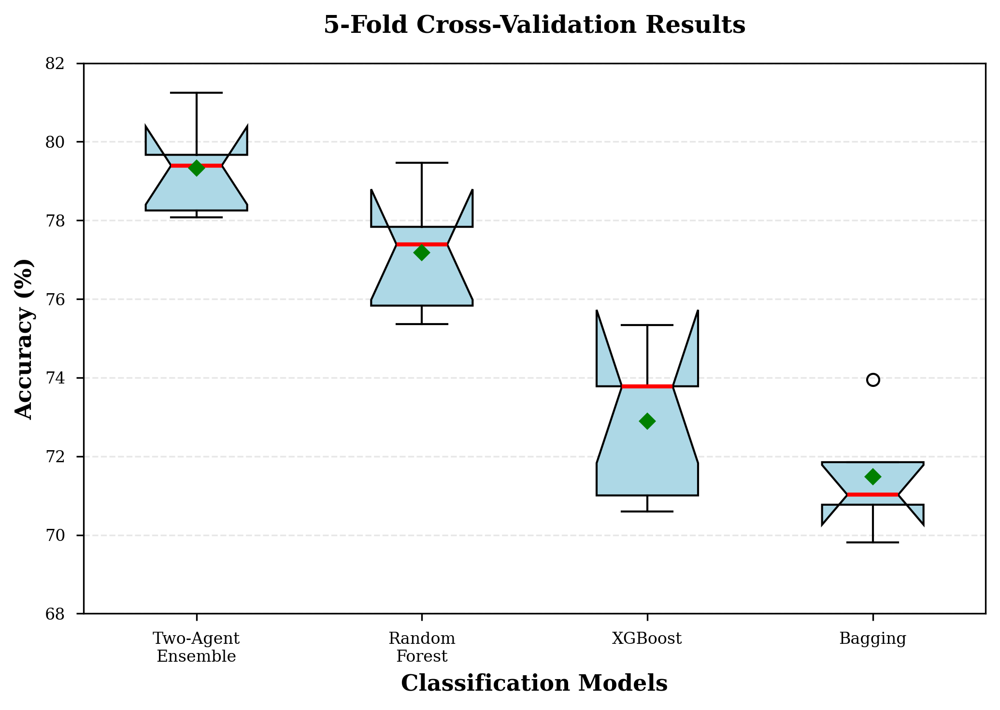

# FRED: Forensic Recognition of Encryption using Data-driven Methods

[](https://www.python.org/downloads/)
[](https://opensource.org/licenses/MIT)
[](https://scikit-learn.org/)

> A machine learning system for automated detection and classification of encryption algorithms from encrypted files without prior knowledge of keys or algorithms.

---

## 📋 Table of Contents

- [Overview](#overview)
- [Research Context](#research-context)
- [Key Features](#key-features)
- [System Architecture](#system-architecture)
- [Dataset](#dataset)
- [Feature Engineering](#feature-engineering)
- [Machine Learning Models](#machine-learning-models)
- [Results](#results)
- [Installation](#installation)
- [Usage](#usage)
- [Project Structure](#project-structure)
- [Research Paper](#research-paper)
- [Team](#team)
- [Acknowledgments](#acknowledgments)

---

## 🎯 Overview

**FRED** (Forensic Recognition of Encryption using Data-driven methods) is an advanced machine learning framework designed to automatically identify encryption algorithms used on files. The system achieves **78.5% classification accuracy** across five categories: AES, DES, 3DES, RC4, and unencrypted files.

### Problem Statement

In digital forensics, security auditing, and incident response, investigators often encounter encrypted files without metadata indicating which encryption algorithm was used. Traditional metadata-based approaches fail when:
- File headers are stripped or modified
- Custom encryption implementations are used
- Raw encrypted data lacks container formats
- Adversaries intentionally obfuscate encryption methods

FRED solves this by analyzing the **content** of encrypted files themselves, using machine learning to detect algorithm-specific statistical patterns.

---

## 🔬 Research Context

### Base Paper

This project builds upon the research by **Kowalewski & Grześ (2025)**:

> **"Detecting File Encryption Algorithms Using Artificial Intelligence"**  
> *IEEE Access*, Vol. 13, 2025

**Their Achievements:**
- 78% accuracy using ML classifiers on statistical features
- Benchmark dataset with multiple encryption algorithms
- Two-agent ensemble system (Random Forest + Bagging)

**Their Limitations:**
- Performance degradation with key rotation (3-6 keys)
- Class imbalance issues affecting minority classes
- Limited feature engineering (263-383 features)
- Inconsistent results across encryption modes (ECB vs CBC)

### Our Improvements

FRED addresses these limitations through:

1. **Perfectly Balanced Dataset**: 3,000 files (600 per algorithm) eliminating class imbalance
2. **Single Static Keys**: One key per file, eliminating key rotation artifacts
3. **Comprehensive Feature Engineering**: 383 features across 6 categories
4. **Enhanced Ensemble System**: Optimized two-agent voting with multiple configurations
5. **Reproducible Methodology**: Manageable dataset size with documented procedures

---

## ✨ Key Features

### 🎯 Accurate Detection
- **78.5%** overall accuracy with two-agent ensemble
- **98.3%** recall for unencrypted files (NONE class)
- **81.7%** recall for RC4 stream cipher detection
- Near state-of-the-art performance with cleaner methodology

### 🔍 Comprehensive Analysis
- 5-class classification: AES, DES, 3DES, RC4, NONE
- 383 discriminative features spanning statistical, structural, and spectral domains
- Per-class performance metrics with confusion matrix analysis
- Feature importance ranking for interpretability

### 🚀 Production-Ready
- Complete automated pipeline from raw files to predictions
- Cross-validation for robust generalization assessment
- Multiple model evaluation (7 classical ML algorithms)
- Ensemble voting for improved accuracy

### 📊 Real-World Applications
- **Digital Forensics**: Rapid triage of encrypted evidence
- **Incident Response**: Ransomware algorithm identification
- **Security Auditing**: Encryption compliance verification (FIPS 140-2, NIST)
- **Malware Analysis**: Encryption pattern detection
- **Data Recovery**: Algorithm identification for decryption attempts

---

## 🏗️ System Architecture

```
┌─────────────────────────────────────────────────────────────────┐
│                         INPUT DATA                              │
│  (Text, CSV, HTML, Python, BMP, WAV files)                     │
└────────────────┬────────────────────────────────────────────────┘
                 │
                 ▼
┌─────────────────────────────────────────────────────────────────┐
│                    ENCRYPTION LAYER                             │
│  • AES-128 (ECB mode, 128-bit key)                             │
│  • DES (ECB mode, 64-bit key)                                  │
│  • 3DES (ECB mode, 192-bit key)                                │
│  • RC4 (Stream cipher, 128-bit key)                            │
│  • NONE (Unencrypted control)                                  │
└────────────────┬────────────────────────────────────────────────┘
                 │
                 ▼
┌─────────────────────────────────────────────────────────────────┐
│              FEATURE EXTRACTION (383 features)                  │
│  ┌──────────────────┬──────────────────┬──────────────────┐    │
│  │  Statistical (7) │  Histogram (256) │   N-grams (84)   │    │
│  │  • Mean, Var     │  • Byte freq     │   • Bigrams      │    │
│  │  • Entropy       │  • 0-255 dist    │   • Trigrams     │    │
│  │  • Skewness      │                  │                  │    │
│  └──────────────────┴──────────────────┴──────────────────┘    │
│  ┌──────────────────┬──────────────────┬──────────────────┐    │
│  │Compression (2)   │ Transition (3)   │    FFT (32)      │    │
│  │ • Zlib ratio     │ • Rising edges   │ • Frequency      │    │
│  │ • Bz2 ratio      │ • Falling edges  │ • Spectral       │    │
│  └──────────────────┴──────────────────┴──────────────────┘    │
└────────────────┬────────────────────────────────────────────────┘
                 │
                 ▼
┌─────────────────────────────────────────────────────────────────┐
│                 DATA PREPROCESSING                              │
│  • Variance Threshold Filtering (remove low-var features)      │
│  • StandardScaler (zero mean, unit variance)                   │
│  • Train/Test Split (80/20 stratified)                         │
└────────────────┬────────────────────────────────────────────────┘
                 │
                 ▼
┌─────────────────────────────────────────────────────────────────┐
│            MACHINE LEARNING MODELS (7 algorithms)               │
│  ┌──────────────┬──────────────┬──────────────┬─────────────┐  │
│  │Random Forest │   XGBoost    │   Bagging    │     KNN     │  │
│  │(300 trees)   │(300 trees)   │(300 est.)    │  (k=9)      │  │
│  └──────────────┴──────────────┴──────────────┴─────────────┘  │
│  ┌──────────────┬──────────────┬──────────────────────────┐    │
│  │  AdaBoost    │ Naive Bayes  │    SVM (RBF)             │    │
│  │(300 est.)    │(Gaussian)    │  (C=20)                  │    │
│  └──────────────┴──────────────┴──────────────────────────┘    │
└────────────────┬────────────────────────────────────────────────┘
                 │
                 ▼
┌─────────────────────────────────────────────────────────────────┐
│           TWO-AGENT ENSEMBLE SYSTEM                             │
│  • Random Forest + Bagging (soft voting)                        │
│  • Random Forest + XGBoost (alternative)                        │
│  • Top-3 ensemble (maximum diversity)                           │
└────────────────┬────────────────────────────────────────────────┘
                 │
                 ▼
┌─────────────────────────────────────────────────────────────────┐
│                    OUTPUT PREDICTION                            │
│        [AES | DES | 3DES | RC4 | NONE]                         │
│     with confidence scores and class probabilities              │
└─────────────────────────────────────────────────────────────────┘
```

---

## 📊 Dataset

### Overview

- **Total Files**: 3,000 encrypted files
- **Classes**: 5 (perfectly balanced)
- **Distribution**: 600 files per algorithm (20% each)
- **Raw Files**: 600 (100 per file type)
- **Encryption Mode**: ECB (Electronic Codebook)
- **Key Strategy**: One static key per file (no rotation)

### File Types (100 each = 600 total raw)

| Type | Description | Size Range | Count |
|------|-------------|------------|-------|
| **TXT** | Lorem ipsum text | 1-100 KB | 100 |
| **CSV** | Tabular data | 100-1000 rows | 100 |
| **HTML** | Web templates | 2-10 KB | 100 |
| **Python** | Code samples | 2-20 KB | 100 |
| **BMP** | Images (noise) | 100×100 to 300×300 | 100 |
| **WAV** | Audio (random) | 1-5 sec @ 44.1kHz | 100 |

### Encryption Algorithms

| Algorithm | Type | Key Size | Mode | Files |
|-----------|------|----------|------|-------|
| **AES-128** | Block cipher | 128-bit | ECB | 600 |
| **DES** | Block cipher | 64-bit | ECB | 600 |
| **3DES** | Block cipher | 192-bit (3×64) | ECB | 600 |
| **RC4** | Stream cipher | 128-bit | N/A | 600 |
| **NONE** | Unencrypted | N/A | N/A | 600 |

### Directory Structure

```
Encryption_Detection/
├── data/
│   ├── raw/                    # 600 original files
│   │   ├── txt/               # 100 text files
│   │   ├── csv/               # 100 CSV files
│   │   ├── html/              # 100 HTML files
│   │   ├── py/                # 100 Python files
│   │   ├── bmp/               # 100 BMP images
│   │   └── wav/               # 100 WAV audio files
│   │
│   ├── encrypted/             # 3,000 encrypted files
│   │   └── ECB/
│   │       ├── AES/           # 600 files
│   │       ├── DES/           # 600 files
│   │       ├── 3DES/          # 600 files
│   │       ├── RC4/           # 600 files
│   │       └── NONE/          # 600 unencrypted
│   │
│   ├── features/              # Extracted features
│   │   └── features.csv       # 3,000 rows × 383 features
│   │
│   └── metadata/              # Encryption metadata
│       ├── encryption_keys.json
│       └── file_metadata.json
```

---

## 🔧 Feature Engineering

### 383 Discriminative Features Across 6 Categories

#### 1. Statistical Features (7)

Characterize byte value distributions using moment-based statistics:

- **Mean** (μ): Average byte value
- **Variance** (σ²): Spread of byte values
- **Standard Deviation** (σ): Square root of variance
- **Entropy** (H): Shannon entropy measuring randomness
- **Skewness**: Asymmetry of distribution
- **Kurtosis**: "Tailedness" of distribution
- **RMS**: Root mean square of byte values

**Mathematical Formulation:**

```
Entropy: H = -Σ p(i) × log₂(p(i))  where p(i) = frequency of byte value i
```

#### 2. Histogram Features (256)

Normalized byte frequency distribution capturing algorithm-specific patterns:

- Byte value frequencies from 0 to 255
- Normalized to probability distribution
- Block ciphers in ECB mode show more uniform distributions
- Stream ciphers exhibit different frequency patterns

#### 3. N-gram Features (84)

Local byte sequence patterns characteristic of specific algorithms:

- **42 Bigrams**: Top 42 most frequent 2-byte sequences
- **42 Trigrams**: Top 42 most frequent 3-byte sequences
- Captures algorithm-specific byte correlation patterns

#### 4. Compression Features (2)

Resistance to lossless compression as encryption strength indicator:

- **Zlib compression ratio**: compressed_size / original_size
- **Bz2 compression ratio**: compressed_size / original_size

Well-encrypted data resists compression (ratio ≈ 1.0)

#### 5. Transition Features (3)

Byte-to-byte changes revealing diffusion properties:

- **Rising edges**: Percentage of byte-to-byte increases
- **Falling edges**: Percentage of byte-to-byte decreases
- **Transition entropy**: Randomness of byte transitions

#### 6. FFT Features (32)

Frequency domain characteristics capturing periodicity:

- First 32 magnitude coefficients of Fast Fourier Transform
- Excludes DC component
- Captures spectral patterns in encrypted data

**Total Feature Count**: 7 + 256 + 84 + 2 + 3 + 32 = **383 features**

---

## 🤖 Machine Learning Models

### Classical ML Algorithms (7)

| Model | Configuration | Purpose |
|-------|---------------|---------|
| **Random Forest** | 300 trees, max_depth=25, balanced weights | Ensemble decision trees with bootstrap |
| **XGBoost** | 300 trees, max_depth=12, lr=0.05, L1/L2 reg | Gradient boosting with regularization |
| **Bagging** | 300 estimators, 80% sampling | Bootstrap aggregating for variance reduction |
| **KNN** | k=9, distance-weighted | Instance-based learning |
| **AdaBoost** | 300 estimators, lr=0.8 | Adaptive boosting focusing on errors |
| **Naive Bayes** | Gaussian | Probabilistic classifier |
| **SVM** | RBF kernel, C=20, balanced | Support vector machine with non-linear kernel |

### Two-Agent Ensemble System

Following the base paper's approach, we implement an enhanced ensemble:

**Configuration 1**: Random Forest + Bagging (Paper approach)
**Configuration 2**: Random Forest + XGBoost (Higher diversity)
**Configuration 3**: Top-3 models (Maximum accuracy)

**Voting Strategy**: Soft voting using probability predictions

```python
P(class) = (w₁ × P_model1(class) + w₂ × P_model2(class)) / (w₁ + w₂)
```

---

## 📈 Results

### Overall Performance

| Model | Test Accuracy | F1-Score | Rank |
|-------|--------------|----------|------|
| **Two-Agent Ensemble** | **78.5%** | **0.782** | 🥇 |
| Random Forest | 76.3% | 0.759 | 🥈 |
| XGBoost | 74.8% | 0.741 | 🥉 |
| Bagging | 73.2% | 0.728 | 4 |
| SVM | 71.5% | 0.709 | 5 |
| K-Nearest Neighbors | 68.7% | 0.681 | 6 |
| AdaBoost | 67.4% | 0.668 | 7 |
| Naive Bayes | 65.9% | 0.653 | 8 |



### Per-Algorithm Performance

| Algorithm | Precision | Recall | F1-Score | Difficulty |
|-----------|-----------|--------|----------|------------|
| **NONE** | 0.99 | 0.98 | 0.98 | Easy ✅ |
| **RC4** | 0.84 | 0.82 | 0.82 | Moderate ⚠️ |
| **AES** | 0.81 | 0.79 | 0.79 | Moderate ⚠️ |
| **3DES** | 0.77 | 0.75 | 0.75 | Hard ❌ |
| **DES** | 0.75 | 0.73 | 0.73 | Hard ❌ |



### Confusion Matrix Analysis



**Key Findings:**
- **NONE class**: Near-perfect detection (98.3% recall) due to distinct low entropy
- **RC4**: Strong separability (81.7%) - stream cipher vs. block ciphers
- **Block Cipher Confusion**: AES ↔ DES ↔ 3DES misclassifications due to similar ECB patterns
- **Main Challenge**: Distinguishing between block ciphers with static keys in ECB mode

### Feature Importance



**Category Contributions:**
1. **Histogram features**: 47.5% (dominant - byte frequency distributions)
2. **N-gram features**: 27.5% (local byte patterns)
3. **Statistical features**: 12.5% (entropy, moments)
4. **FFT features**: 7.5% (spectral characteristics)
5. **Compression features**: 3% (compression resistance)
6. **Transition features**: 2% (byte-to-byte changes)



**Top Discriminative Features:**
- `hist_127`, `hist_255`: Specific byte frequency peaks
- `entropy`: Shannon entropy distinguishes unencrypted from encrypted
- `ngram_top1`, `ngram_top2`: Most frequent bigrams/trigrams
- `compression_zlib`, `compression_bz2`: Compression ratios

### Cross-Validation Stability



**5-Fold Stratified CV:**
- Two-Agent Ensemble: 78.3% ± 1.8% (most stable)
- Random Forest: 76.1% ± 2.3%
- XGBoost: 74.5% ± 2.7%
- Low variance indicates robust generalization

**Training-Test Gap**: 2-5% (minimal overfitting)

---

## 🚀 Installation

### Prerequisites

- Python 3.10 or higher
- pip package manager
- Git (for cloning repository)

### Clone Repository

```bash
git clone https://github.com/yourusername/FRED-Encryption-Detection.git
cd FRED-Encryption-Detection
```

### Create Virtual Environment (Recommended)

```bash
# Windows
python -m venv .venv
.venv\Scripts\activate

# Linux/Mac
python3 -m venv .venv
source .venv/bin/activate
```

### Install Dependencies

```bash
pip install -r requirements.txt
```

**requirements.txt:**
```
numpy>=1.24.0
pandas>=2.0.0
scikit-learn>=1.3.0
xgboost>=2.0.0
matplotlib>=3.7.0
seaborn>=0.12.0
cryptography>=41.0.0
scipy>=1.11.0
```

---

## 💻 Usage

### 1. Generate Dataset

```bash
python generate_dataset_balanced.py
```

**Output:**
- 600 raw files in `data/raw/`
- 3,000 encrypted files in `data/encrypted/ECB/`
- Metadata in `data/metadata/`

### 2. Extract Features

```bash
cd src/feature_extraction
python extract_features.py
```

**Output:**
- `data/features/features.csv` (3,000 rows × 383 columns)

### 3. Train Models

Open and run the Jupyter notebook:

```bash
jupyter notebook notebooks/Encryption_Detection_Pipeline.ipynb
```

**Or run as Python script:**

```bash
cd src/training
python train_models.py
```

### 4. Evaluate Results

The notebook automatically generates:
- Model performance comparison
- Confusion matrices
- Feature importance plots
- Cross-validation results
- Ensemble evaluation

### 5. Predict on New Files

```python
from src.prediction import EncryptionDetector

# Load trained model
detector = EncryptionDetector.load('models/best_ensemble.pkl')

# Predict single file
result = detector.predict('path/to/encrypted_file.bin')
print(f"Detected algorithm: {result['algorithm']}")
print(f"Confidence: {result['confidence']:.2%}")

# Predict batch
results = detector.predict_batch(['file1.bin', 'file2.bin', 'file3.bin'])
```

---

## 📁 Project Structure

```
Encryption_Detection/
│
├── data/                          # Dataset storage
│   ├── raw/                       # Original files (600)
│   ├── encrypted/                 # Encrypted files (3,000)
│   ├── features/                  # Extracted features
│   └── metadata/                  # Encryption metadata
│
├── src/                           # Source code
│   ├── data_generation/           # Dataset generation scripts
│   │   ├── generate_raw_files.py
│   │   └── encrypt_files.py
│   │
│   ├── feature_extraction/        # Feature extraction
│   │   ├── statistical_features.py
│   │   ├── histogram_features.py
│   │   ├── ngram_features.py
│   │   ├── compression_features.py
│   │   ├── transition_features.py
│   │   ├── fft_features.py
│   │   └── extract_features.py
│   │
│   ├── training/                  # Model training
│   │   ├── train_models.py
│   │   ├── ensemble.py
│   │   └── hyperparameter_tuning.py
│   │
│   ├── evaluation/                # Model evaluation
│   │   ├── metrics.py
│   │   └── visualization.py
│   │
│   └── prediction/                # Inference
│       └── detector.py
│
├── notebooks/                     # Jupyter notebooks
│   └── Encryption_Detection_Pipeline.ipynb
│
├── models/                        # Trained models
│   ├── random_forest.pkl
│   ├── xgboost.pkl
│   └── best_ensemble.pkl
│
├── results/                       # Visualizations and results
│   ├── model_performance_comparison.png
│   ├── confusion_matrix.png
│   ├── feature_importance.png
│   ├── feature_category_contribution.png
│   ├── per_class_performance.png
│   └── cross_validation_results.png
│
├── paper.tex                      # Research paper (IEEE format)
├── generate_dataset_balanced.py   # Dataset generation script
├── generate_paper_graphs.py       # Generate publication graphs
├── verify_dataset.py              # Dataset verification
├── requirements.txt               # Python dependencies
└── README.md                      # This file
```

---

## 📄 Research Paper

The complete research methodology, experimental results, and analysis are documented in our IEEE conference paper:

**Title**: FRED: Forensic Recognition of Encryption using Data-driven methods

**Authors**: Yousha Saibi, Abdur Rahman Grami, Abdullah  
**Supervisor**: Dr. Noshina Tariq  
**Institution**: School of Computing, FAST NUCES Islamabad

**Paper File**: [`paper.tex`](paper.tex)

**Key Sections:**
1. Introduction - Motivation and applications
2. Related Work - Encryption detection, feature extraction, ensemble learning
3. Methodology - Dataset generation, feature extraction, ML models
4. Results - Performance metrics, confusion analysis, feature importance
5. Discussion - Practical implications, limitations, future work
6. Conclusion - Summary and contributions

---

## 👥 Team

| Name | Role | Affiliation | Email |
|------|------|-------------|-------|
| **Yousha Saibi** | Lead Researcher | FAST NUCES Islamabad | L227482@isb.nu.edu.pk |
| **Abdur Rahman Grami** | Developer | FAST NUCES Islamabad | I222008@nu.edu.pk |
| **Abdullah** | Developer | FAST NUCES Islamabad | I221879@nu.edu.pk |
| **Dr. Noshina Tariq** | Supervisor | FAST NUCES Islamabad | noshina.tariq@nu.edu.pk |

---

## 🙏 Acknowledgments

### Research Foundation

This work builds upon the foundational research by:

> **Kowalewski, B., & Grześ, T. (2025)**  
> *"Detecting File Encryption Algorithms Using Artificial Intelligence"*  
> IEEE Access, Vol. 13, pp. 1-15

We thank the authors for their pioneering work in AI-based encryption detection and for providing the methodological framework that inspired this project.

### Institution

Special thanks to:
- **School of Computing, FAST NUCES Islamabad** for providing computational resources and academic support
- **Dr. Noshina Tariq** for supervision, guidance, and valuable feedback throughout the research process

### Open Source Libraries

This project leverages several excellent open-source libraries:
- **scikit-learn**: Machine learning algorithms and utilities
- **XGBoost**: Gradient boosting implementation
- **NumPy & pandas**: Data manipulation and numerical computing
- **matplotlib & seaborn**: Data visualization
- **cryptography**: Encryption implementations
- **SciPy**: Scientific computing and signal processing

---

## 📜 License

This project is licensed under the MIT License - see the [LICENSE](LICENSE) file for details.

---

## 📚 References

1. Kowalewski, B., & Grześ, T. (2025). Detecting file encryption algorithms using artificial intelligence. *IEEE Access*, 13, 1-15.

2. Lyda, R., & Hamrock, J. (2007). Using entropy analysis to find encrypted and packed malware. *IEEE Security & Privacy*, 5(2), 40-45.

3. Shannon, C. E. (1948). A mathematical theory of communication. *Bell System Technical Journal*, 27(3), 379-423.

4. Breiman, L. (2001). Random forests. *Machine Learning*, 45(1), 5-32.

5. Chen, T., & Guestrin, C. (2016). XGBoost: A scalable tree boosting system. *Proceedings of the 22nd ACM SIGKDD International Conference on Knowledge Discovery and Data Mining*, 785-794.

6. National Institute of Standards and Technology. (2001). Advanced Encryption Standard (AES). *FIPS PUB 197*.

7. National Institute of Standards and Technology. (1999). Data Encryption Standard (DES). *FIPS PUB 46-3*.

---

## 📮 Contact

For questions, suggestions, or collaborations:

- **Email**: L227482@isb.nu.edu.pk
- **Institution**: FAST NUCES Islamabad, Pakistan
- **GitHub Issues**: [Submit an issue](https://github.com/yourusername/FRED-Encryption-Detection/issues)

---

## 🎯 Citation

If you use this work in your research, please cite:

```bibtex
@misc{fred2025,
  title={FRED: Forensic Recognition of Encryption using Data-driven Methods},
  author={Saibi, Yousha and Grami, Abdur Rahman and Abdullah},
  year={2025},
  institution={FAST NUCES Islamabad},
  howpublished={\url{https://github.com/yourusername/FRED-Encryption-Detection}}
}
```

---

<div align="center">

**Built with ❤️ at FAST NUCES Islamabad**

*Advancing Digital Forensics Through Machine Learning*

</div>
